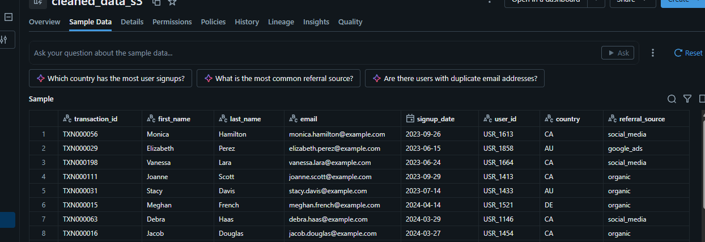
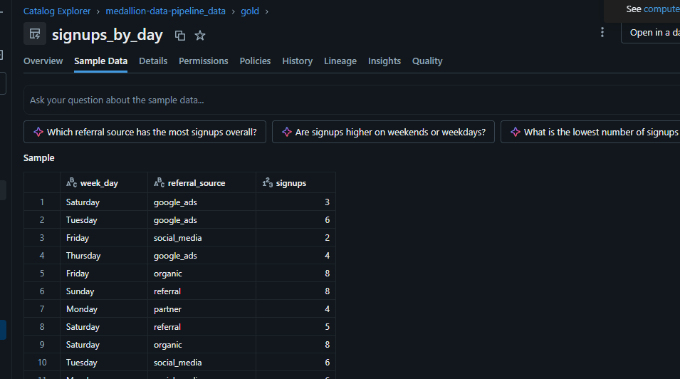
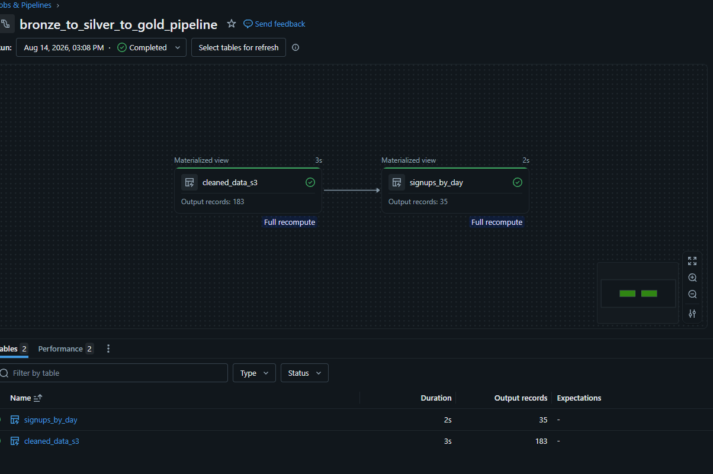

# medallion-data-pipeline
Medallion data pipeline (Bronze/Silver/Gold) featuring custom input file generation, automated multi-stage processing, and load-ready file export.
"# medallion-data-pipeline" 
## Step 1: Pre-loading & Data Generation

Before triggering the Databricks ingestion pipeline, synthetic raw data must be generated.

* **Type:** Pre-loading process (Data Seeding)
* **Script:** `seeds/generate_users_dirty_data_file.ipynb`
* **Description:** Simulates raw source data by generating synthetic user records containing deliberate quality 
* issues (missing fields, inconsistent formats).
* **Destination:** Writes files to `user_dirty_files` for S3 upload (`s3://dirtyusersplacement/main_file`), ready for the Bronze layer.

## Step 2: Data Ingestion from AWS S3 into Databricks

Source Data Landing (AWS S3): Uploaded raw user information in CSV format to an S3 bucket to serve as the 
landing zone for raw data.

Catalog & Governance Setup (Databricks): Established a Unity Catalog structure and configured the step1 schema 
to isolate ingestion artifacts and maintain data lineage.

## Step 3: Layers 

### 🟤 Bronze Layer: Ingestion
* **Objective:** Ingest raw data from cloud storage with zero schema transformations.
* **Implementation:** Built and executed the **"Ingest from S3"** pipeline to convert raw CSV files into native Delta tables within the `bronze` schema.

---

### ⚪ Silver Layer: Data Cleansing & Transformation
* **Objective:** Enforce data quality, schema validation, and consistency.
* **Transformations Applied:**
  * Imputed/filtered null values.
  * Removed duplicate records to enforce business key uniqueness.
  * Standardized date formatting and cast correct data types across fields.

---

### 🟡 Gold Layer: Business Aggregations
* **Objective:** Power downstream analytics and reporting models.
* **Output:** Built aggregated business metrics, including daily user onboarding analysis (**Signups by Day of Week and Source**).

---

### Pipeline for transformation Bronze - Silver - Gold
**Code Implementation:** [`src/transform_silver.py`](scripts/Databricks_ETL/bronze_to_silver__to_gold_transformation.ipynb) *(Developed & tested in Databriks ETL pipeline)*

