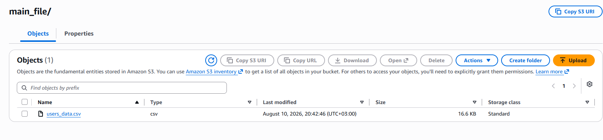
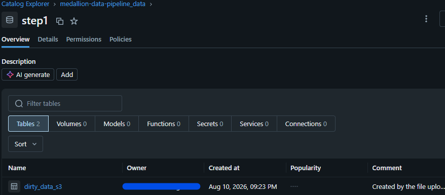
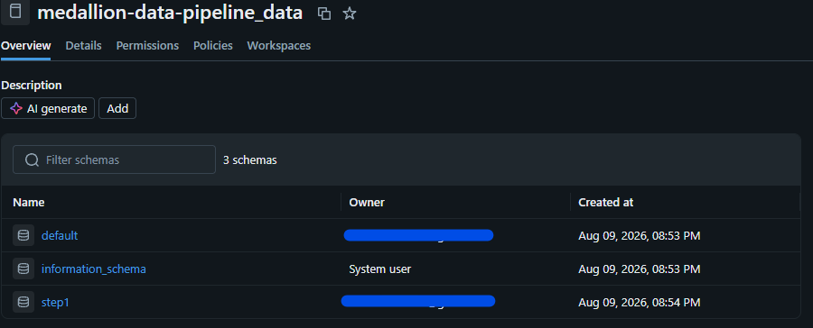

# medallion-data-pipeline
Medallion data pipeline (Bronze/Silver/Gold) featuring custom input file generation, automated multi-stage processing, and load-ready file export.
"# medallion-data-pipeline" 
## Step 1: Pre-loading & Data Generation

Before triggering the Databricks ingestion pipeline, synthetic raw data must be generated.

* **Type:** Pre-loading process (Data Seeding)
* **Script:** `seeds/generate_users_dirty_data_file.ipynb`
* **Description:** Simulates raw source data by generating synthetic user records containing deliberate quality 
* issues (missing fields, inconsistent formats).
* **Destination:** Writes files to `user_dirty_files` for S3 upload (`s3://dirtyusersplacement/main_file`), ready for the Bronze layer.

## Step 2: Data Ingestion from AWS S3 into Databricks

Source Data Landing (AWS S3): Uploaded raw user information in CSV format to an S3 bucket to serve as the 
landing zone for raw data.

Catalog & Governance Setup (Databricks): Established a Unity Catalog structure and configured the step1 schema 
to isolate ingestion artifacts and maintain data lineage.

Pipeline Execution & Ingestion: Built and executed the "Ingest from S3" pipeline to process the raw CSV files into Delta tables within the step1 schema, establishing the project's Bronze layer.

